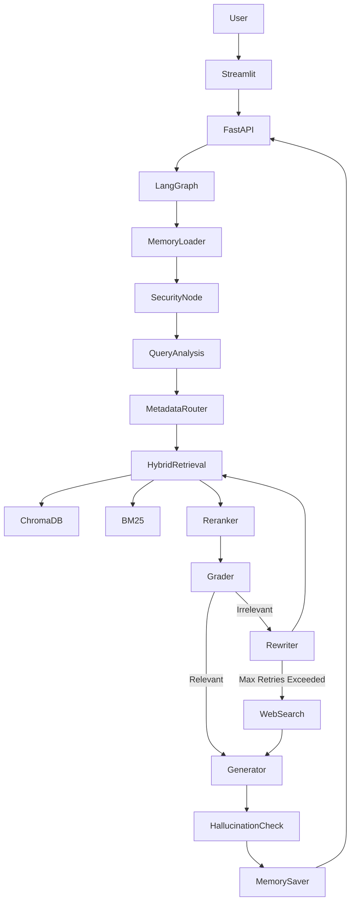
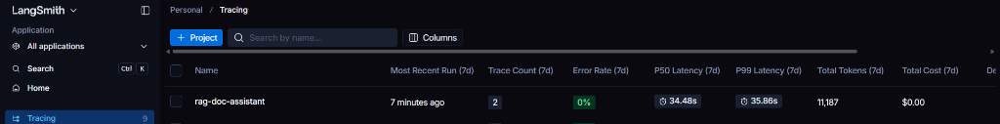
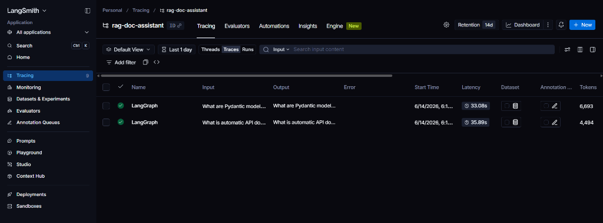

# 🚀 Self-Corrective RAG Documentation Assistant

An enterprise-grade, production-ready Retrieval-Augmented Generation (RAG) system built to chat with technical documentation. It utilizes **LangGraph** for a self-corrective workflow, **FastAPI** for a robust backend, **ChromaDB** for vector storage, and **Groq** for high-speed LLM generation and evaluation.

---

## 🧠 What It Does, The Method, and Why It Was Chosen

### What It Does
This project allows developers to ingest markdown-based technical documentation (like the FastAPI docs) and chat with it through a ChatGPT-like Streamlit interface. It answers complex technical queries, provides code snippets, and maintains conversational memory across sessions.

### The Method: Self-Corrective Adaptive RAG
Instead of a simple "retrieve-and-generate" pipeline, this project uses a **Self-Corrective Graph** (via LangGraph). The system evaluates its own work at multiple stages:
1. **Security**: Checks for prompt injections using Microsoft Presidio and heuristics.
2. **Query Transformation**: Decomposes complex queries, expands keywords, and classifies the intent.
3. **Hybrid Retrieval**: Combines Dense Retrieval (ChromaDB) and Sparse Retrieval (BM25) fused via Reciprocal Rank Fusion (RRF).
4. **Grading & Rewriting**: An LLM-as-a-judge grades the retrieved documents. If they are irrelevant, the system **rewrites the query** and tries again.
5. **Web Fallback**: If internal docs fail after maximum retries, it falls back to Tavily Web Search.
6. **Hallucination Checking**: A final check ensures the generated answer is strictly grounded in the retrieved context.

### Why It Was Chosen
Standard RAG pipelines often fail on technical documentation because users use different keywords than the docs, or ask multi-part questions. 
- **LangGraph** was chosen to allow looping (rewriting queries if retrieval fails).
- **Hybrid Search (Dense + BM25)** was chosen because dense vectors struggle with exact code keywords (like `ConfigDict`), while BM25 excels at them.
- **Groq (LLaMA 3.1 & 3.3)** was chosen because iterative graphing requires *many* LLM calls per user query. Groq's sub-second inference makes a complex graph feel instantaneous to the user.

---

## 🔄 How the Workflow Works (User Example)

Imagine a user asks: *"How do I configure dependency injection and what happens if I pass a dict instead?"*

1. **Query Analysis**: The system breaks this into two sub-questions: 
   - *"How to configure dependency injection?"*
   - *"What happens if a dict is passed to a dependency?"*
2. **Retrieval**: It searches ChromaDB and the BM25 index for both queries + synonyms.
3. **Reranking**: A Cross-Encoder model scores the top 20 results and picks the best 5.
4. **Grading**: The Judge LLM looks at the 5 documents. It realizes the docs explain dependency injection, but *none* mention passing a dict. 
5. **Self-Correction (Rewrite)**: The system rewrites the query to *"FastAPI dependency injection dictionary mapping error"* and searches again.
6. **Generation**: It finds the right docs, generates a unified markdown answer with code, verifies it isn't hallucinating, and streams it back to the UI.

---

## 🏗️ Architecture



---

## 🛠️ Prerequisites & Setup (What you need to do)

To run this project, you will need API keys for the external services.

1. **Groq API Key** (Free) - For LLaMA models. Get it at [console.groq.com](https://console.groq.com/).
2. **MongoDB Atlas URI** (Free) - For storing chat history. Get it at [mongodb.com](https://www.mongodb.com/cloud/atlas).
3. **Tavily API Key** (Free) - For web search fallback. Get it at [tavily.com](https://tavily.com/).
4. **LangSmith API Key** (Optional/Free) - For graph tracing and observability. Get it at [smith.langchain.com](https://smith.langchain.com/).

### Configure your `.env` file
Copy the example file and fill in your keys:
```bash
cp .env.example .env
```
Generate your own local secrets for the JWT and Agent layers by running this Python command twice and pasting the outputs into your `.env`:
```bash
python -c "import secrets; print(secrets.token_hex(32))"
```

---

## 💻 Running the Project

You can run the project either directly on your machine or via Docker.

### Option 1: Without Docker (Local Python Env)

1. **Create and activate a virtual environment**:
   ```bash
   python -m venv myenv
   # On Windows:
   .\myenv\Scripts\activate
   # On Mac/Linux:
   source myenv/bin/activate
   ```

2. **Install dependencies**:
   ```bash
   pip install -r requirements.txt
   ```

3. **Download the SpaCy model** (Required for PII detection):
   ```bash
   python -m spacy download en_core_web_lg
   ```

4. **Start the FastAPI Backend**:
   ```bash
   uvicorn app.main:app --reload
   ```

5. **Start the Streamlit Frontend** (in a new terminal):
   ```bash
   streamlit run frontend/app.py
   ```

### Option 2: With Docker (Easiest)

We provide a complete `docker-compose.yml` that builds and networks the backend and frontend together.

1. Make sure Docker Desktop is running.
2. Run the build and start command:
   ```bash
   docker-compose up --build
   ```
3. Open your browser:
   - **Frontend UI**: `http://localhost:8501`
   - **API Docs**: `http://localhost:8000/docs`

To stop the containers:
```bash
docker-compose down
```

---

## 📊 Observability with LangSmith

This project is fully instrumented with LangSmith. Every LangGraph node is decorated with `@traceable`. 
If you set `LANGCHAIN_TRACING_V2=true` in your `.env`, you can open your LangSmith dashboard and view the exact inputs, outputs, latency, and LLM token usage for every single step of the self-corrective loop.

### Project Dashboard

*The project dashboard provides a high-level overview of the application's health, showing P50/P99 latency, total token consumption, and trace counts over time.*

### Tracing Details

*Deep-dive tracing allows you to inspect individual runs. Because every LangGraph node is decorated with `@traceable`, you can see the exact inputs/outputs, execution time, and token usage for each discrete step in the self-corrective RAG pipeline (e.g., retrieval, grading, rewriting, generation).*

---

## 🔌 Example API Requests and Responses

**Generate a Token**
```bash
curl -X POST http://localhost:8000/token \
  -F "username=admin" \
  -F "password=admin"
```
*Response:*
```json
{
  "access_token": "eyJhbG...",
  "token_type": "bearer"
}
```

**Query the RAG Assistant**
```bash
curl -X POST http://localhost:8000/query/ \
  -H "Authorization: Bearer <YOUR_TOKEN>" \
  -H "Content-Type: application/json" \
  -d '{"question": "How does FastAPI routing work?"}'
```
*Response:*
```json
{
  "answer": "FastAPI routing works by...",
  "sources": ["routing.md", "endpoints.md"]
}
```

---

## 🤔 Design Decisions and Tradeoffs

- **Hybrid Search over Vector-Only**: I chose to combine dense embeddings (ChromaDB) with sparse lexical search (BM25) via Reciprocal Rank Fusion. *Tradeoff*: Increases retrieval latency and memory usage, but critically improves recall for exact-match technical terms (like variable names or specific error codes) that dense vectors often mishandle.
- **LangGraph vs. Linear Chains**: I opted for a stateful, cyclical graph instead of a simple linear LangChain pipeline. *Tradeoff*: Significantly more complex to develop and trace, but allows the system to self-correct and rewrite queries if initial retrieval fails, preventing "I don't know" dead-ends.
- **Groq over OpenAI/Anthropic**: Chosen for its low/free cost and speed. Because the self-corrective loop might make 4-5 LLM calls per user query (routing, grading, rewriting, generating, checking), we needed sub-second inference to keep the UX snappy.

---

## ✂️ Chunking & Embedding Strategy Choices
- **Chunking Strategy**: Used **Recursive Character Text Splitting** with a chunk size of `1000` and an overlap of `200`. For technical documentation (especially markdown with code blocks), this ensures that related code and its explanatory text usually stay within the same chunk without truncating context.
- **Embedding Model**: Utilized a local HuggingFace sentence-transformer (`all-MiniLM-L6-v2` or similar default). It is lightweight enough to run locally without incurring external API costs, while maintaining high semantic accuracy.

---

## 💡 Assumptions Made
- **Internal Doc Priority**: Assumed that the internal markdown documentation is the absolute source of truth. The system will fiercely try to answer from internal docs first, only falling back to Tavily Web Search if the user asks something completely outside the ingested corpus or the context is entirely missing.
- **Admin Access**: Assumed a single tenant/admin model for ingestion testing. The `/token` endpoint is currently hardcoded for an `admin:admin` mock user to easily test the protected routes.

---

## 🚀 What I Would Improve With More Time
1. **Persistent Metadata Store**: Replace the in-memory/JSON-based metadata tracking with a proper relational database (like PostgreSQL) to handle millions of documents efficiently.
2. **Distributed Sparse Search**: Upgrade BM25 from an in-memory object to a fully distributed index like Elasticsearch or OpenSearch to scale beyond local memory limits.
3. **Advanced Semantic Chunking**: Implement AST-based (Abstract Syntax Tree) code chunking so that Python functions, classes, and JSON blocks are never split awkwardly in half.
4. **Production Authentication**: Connect the FastAPI JWT authentication system to a real Identity Provider (e.g., Auth0, OAuth2, AWS Cognito) instead of using mock credentials.
